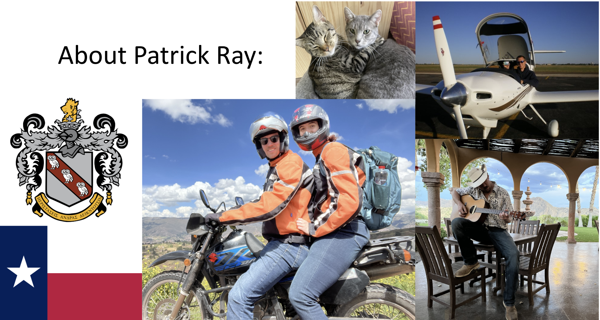
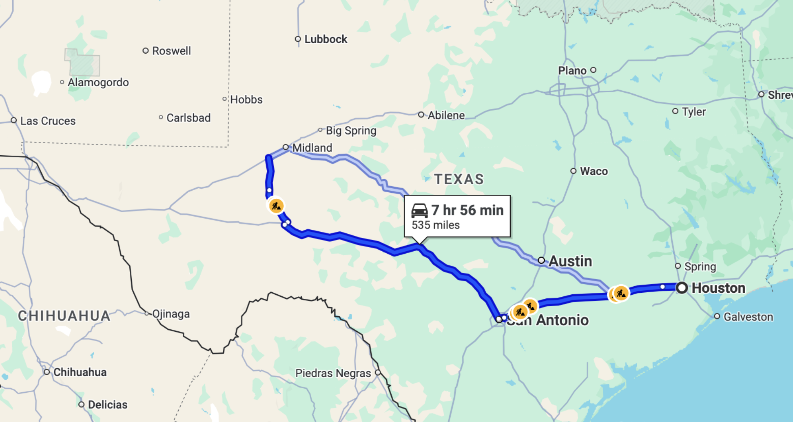
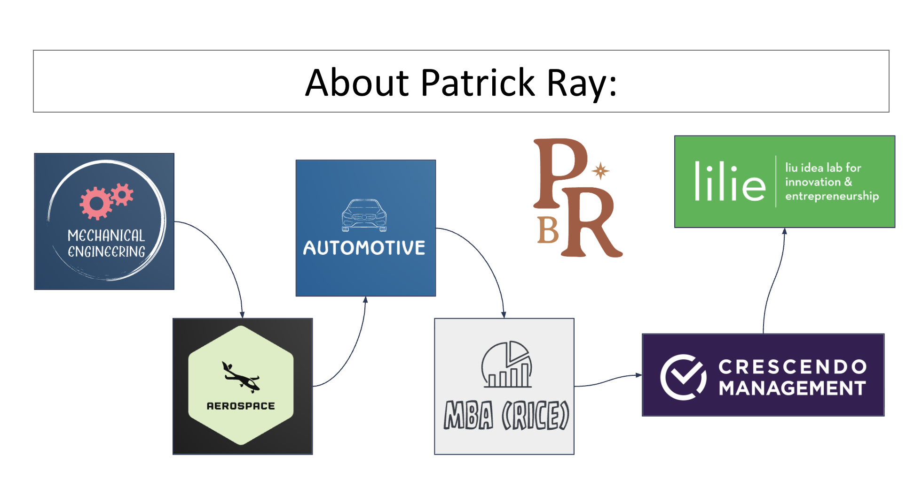

<!-- _class: title -->

Session 1

# Course Intro + Navigate Ambiguity

<h2>Design Thinking for MBAs (Hybrid Section)</h2>

Thursday, February 26, 2026 &ensp;|&ensp; 6:30 PM &ensp;|&ensp; Online (Zoom) &ensp;|&ensp; Faculty: Patrick Ray

---

---

---

---

## Welcome

Welcome to MGMT 625, Section 002. This is a 6-session hybrid course in Design Thinking.

Let's get to know who's in the room.

DROP IN CHAT

Your name, where you're located, and one word for how you feel about ambiguity.

"This section has people in different cities, different industries, different contexts. That's not a limitation of the hybrid format. It's the whole point."

---

## Why This Course

Every one of you will face problems in your career where the case study doesn't exist yet. Where the data is ambiguous, the stakeholders disagree, and the "right answer" depends on questions nobody has thought to ask. This course gives you a structured process for those moments.

**What we're building over six sessions:**

  
Primary Research Methods

  
&#8594;

  
Systems Modeling

  
&#8594;

  
Problem Definition

  
&#8594;

  
Hypothesis Testing

Each phase has specific analytical tools. Each deliverable asks you to show your reasoning.

---

## Seven Design Abilities

These aren't abstract concepts. They're professional competencies.

| Ability | When You'll Use It |
|---------|-------------------|
| **Navigate Ambiguity** | Leading a team through a reorg when nobody knows the new structure yet |
| **Learn From Others** | Entering a new market when your assumptions about the customer are wrong |
| **Synthesize Information** | 40 customer interviews, and you need the three patterns that matter |
| **Experiment Rapidly** | Your CEO wants a recommendation by Friday and you have three approaches |
| **Move Between Concrete & Abstract** | A frontline employee describes a workaround. You need to find the structural problem it reveals. |
| **Build & Craft Intentionally** | Rough concept for your board vs. polished deck for investors. Different resolution for different feedback. |
| **Communicate Deliberately** | Recommending a strategy where the reasoning matters as much as the answer |

---

## Course at a Glance

  
Phase 1

  
Empathy & Observation

  
Sessions 1-2

  
Phase 2

  
Problem Definition

  
Sessions 3-4

  
Phase 3

  
Ideation & Testing

  
Sessions 5-6

- **6 sessions**: 4 online (90 min) + 2 in-person (4.5 hrs)
- **2 projects**: Individual observation, then team design challenge
- **7 design abilities**: You'll experience all seven. We'll name them as we go.

---

## The Hybrid Advantage

### Online Sessions
- Framing and synthesis
- Team coordination
- Research planning

### In-Person Sessions
- Hands-on activities
- Team formation
- Final presentations

- **Async fieldwork**: Research conducted in YOUR environments (workplaces, neighborhoods, cities)

"In a traditional class, everyone observes the same campus coffee shop. In this class, you'll observe your own workplaces, neighborhoods, and cities. That diversity is what makes the research richer."

---

## How This Course Works

### Grading
- **Specs-based**: Credit for meeting specifications
- Attendance & Participation: 25%
- Individual Assignments: 35%
- Team Assignments: 40%

### Tokens
- 6 tokens total
- 3 for 24-hour extensions
- 3 for revisions
- Teams get 3 revision tokens

**Your notebook** (physical or digital) goes with you the entire course. Start using it tonight.

---

## Six Sessions

| # | Date | Format | Focus |
|---|------|--------|-------|
| **1** | Thu, Feb 26 | Online | Course Intro + Navigate Ambiguity |
| **2** | Sat, Mar 7 | In-Person | Observation Debrief + Team Formation |
| **3** | Thu, Mar 12 | Online | Stakeholder Mapping + Research Planning |
| **4** | Thu, Mar 26 | Online | Research Synthesis + Problem Definition |
| **5** | Sat, Apr 4 | In-Person | Final Presentations + Stress Testing |
| **6** | Thu, Apr 9 | Online | Reflection + Course Close |

Two-week research gap between Sessions 3 and 4 is intentional. That's when your team does distributed fieldwork.

---

## Let's Try Something

I'm going to show you **three short videos**.

Your only job is to **watch** and **write** in your notebook.

No other instructions.

Have your notebook ready. Pen or keyboard, your choice.

---

Video 1

## Watch. Write.

Observe what you see. Write what you notice.

<a href="https://www.youtube.com/watch?v=hZ1OgQL9_Cw&t=90" target="_blank" style="display: flex; height: 280px; background: #0F172A; border-radius: 12px; align-items: center; justify-content: center; text-decoration: none; cursor: pointer;">
  

    

      

    

    
Click to play: NYC 1910s (~4 min excerpt)

  

</a>

---

DROP IN CHAT

One word for what you just experienced.

---

Video 2

## Watch. Write.

Keep observing. Keep writing.

<a href="https://www.youtube.com/watch?v=CYPwPA08KE4" target="_blank" style="display: flex; height: 280px; background: #0F172A; border-radius: 12px; align-items: center; justify-content: center; text-decoration: none; cursor: pointer;">
  

    

      

    

    
Click to play: Tokyo Shibuya, Rambalac (~3 min excerpt)

  

</a>

---

DROP IN CHAT

One word for what you just experienced.

---

Video 3

## Watch. Write.

Last one. Watch closely.

<a href="https://vimeo.com/467675747" target="_blank" style="display: flex; height: 280px; background: #0F172A; border-radius: 12px; align-items: center; justify-content: center; text-decoration: none; cursor: pointer;">
  

    

      

    

    
Click to play: Stainless, Dadar (Adam Magyar, ~2 min excerpt)

  

</a>

---

Two minutes of silent writing.

Write whatever is in your head. Don't filter it.

---

<!-- _class: transition -->

# Make Sense of It

---

## Make Sense of It

- What did you not know while watching?
- When did you start **making up stories** or explanations?
- What was it like to keep watching **without understanding**?
- Did your strategy change from video 1 to video 3?
- Where did certainty creep in, and **was it real**?

---

## Navigate Ambiguity

What you just experienced is <strong>Navigate Ambiguity</strong>. Sitting with incomplete information and resisting the urge to resolve it prematurely. That's the first of seven design abilities, and it's the hardest one.

### In Your Career
- **Consulting**: Diagnosing the real problem vs. confirming your first hypothesis
- **Leadership**: Reacting to symptoms vs. understanding the system

### In This Course
- **TETHER**: Watching without interpreting
- **Research**: Gathering data before defining the problem
- **Problem definition**: Resisting premature solutions

THINK ABOUT THIS

Where in your work do you feel pressure to have the answer immediately?

---

## Your First Assignment

  Take
  Extended
  Time to
  Hold
  Everything in
  Review

- **90 minutes** of uninterrupted observation in YOUR environment
- Choose a place where people interact with systems, spaces, or each other
- Notebook and pen only. No laptop. Phone on silent and away.
- Document what you see, not what you think it means
- Write a half-page reflection after

---

## Where Will You Observe?

### Good Locations
- Your workplace lobby or common area
- A local coffee shop
- Public transit
- A grocery store
- Your neighborhood park

### What Makes It Work
- People interacting with systems or spaces
- Enough activity to watch for 90 minutes
- A place you can sit without drawing attention
- Somewhere in YOUR context, not on campus

"Your observation location is unique to you. When we come together in Session 2, we'll have observations from completely different worlds. That's data no single-campus class can match."

---

## Find the Duct Tape

One more ongoing practice that runs the entire course.

Each week, identify one **"duct tape" solution** you encounter in the wild: a workaround, an improvised fix, a hack someone uses because the real solution doesn't exist.

Document it in your notebook:

1. What is the workaround?
2. What problem does it solve?
3. Why doesn't the real fix exist?

Over the course, your collection will start to show patterns about how systems fail and how people adapt. That's design thinking in action.

---

<!-- _class: closing -->

## What's Next

- Complete your **TETHER observation** before Session 2
- **Session 2**: Saturday, March 7, 8:00 AM to 12:30 PM
- In-person at **McNair Hall 216**
- Bring your notebook with completed TETHER

Start thinking about where you'll do your TETHER. The location matters.

See you March 7.

