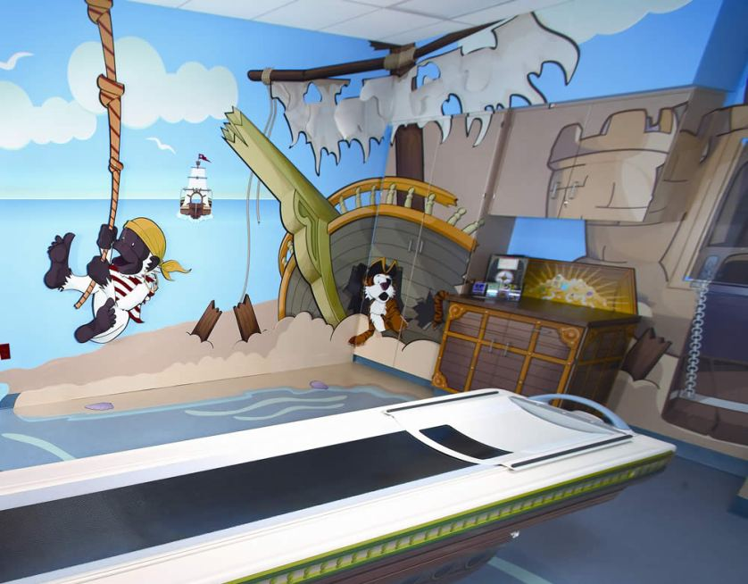
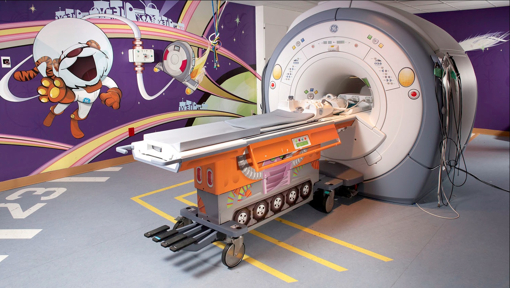
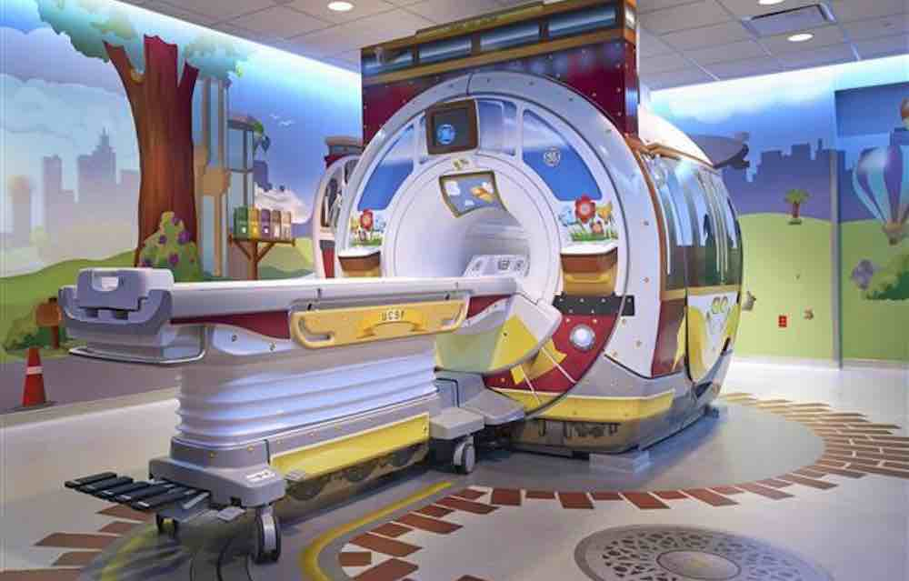

<!-- _class: title -->

Session 2

# Observation Debrief + Team Formation

<h2>Design Thinking for MBAs (Hybrid Section)</h2>

Saturday, March 7, 2026 &ensp;|&ensp; 8:00 AM &ensp;|&ensp; In-Person (McNair Hall 216) &ensp;|&ensp; Faculty: Patrick Ray

---

## Today's Plan

  
Morning

  
Observation Tools

  
Duct Tape debrief, AEIOU framework

  
Field Trip

  
AEIOU Live

  
METRORail ride, paired observation

  
Afternoon

  
Project 2 Launch

  
Scenarios, teams, research planning

Three arcs, one through-line: learning to see what's actually happening before deciding what it means.

---

## Find the Duct Tape

You've been looking for workarounds and improvised fixes since Session 1. **What did you find?**

1. What's the fix?
2. What's the real problem underneath?
3. Why hasn't the real fix happened?

3-4 volunteers share with the class

---

## AEIOU: An Observation Framework

  

    <strong style="color: var(--teal); font-family: 'Montserrat', sans-serif; font-size: 1.1em;">A</strong><strong> = Activities</strong> 
    What are people doing? Tasks, routines, sequences?
  

  

    <strong style="color: var(--teal); font-family: 'Montserrat', sans-serif; font-size: 1.1em;">E</strong><strong> = Environments</strong> 
    What's the space like? How does it shape behavior?
  

  

    <strong style="color: var(--teal); font-family: 'Montserrat', sans-serif; font-size: 1.1em;">I</strong><strong> = Interactions</strong> 
    Between people? Between people and objects or systems?
  

  

    <strong style="color: var(--teal); font-family: 'Montserrat', sans-serif; font-size: 1.1em;">O</strong><strong> = Objects</strong> 
    What tools, artifacts, devices are present? What's missing?
  

  

    <strong style="color: var(--teal); font-family: 'Montserrat', sans-serif; font-size: 1.1em;">U</strong><strong> = Users</strong> 
    Who's here? Who's NOT here? Different types?
  

In consulting, this is one way to structure a site visit. In product development, it's a useful lens for documenting user behavior.

---

## AEIOU Applied

Look at your TETHER notes. Which of these five did you naturally gravitate toward? Which did you miss?

REFLECT

Most people over-index on Activities and under-index on Environment and Users. Where did you land?

<strong>Design Ability: Move Between Concrete and Abstract.</strong> AEIOU helps you do this. You zoom into a specific interaction, then zoom out to ask what it means for the system.

---

## Train Ride: AEIOU in the Field

You just learned the AEIOU framework from your own notes. **Now use it live.**

- Pair up. You'll observe together and compare notes after.
- Use AEIOU on everything you see: the walk, the platform, the train, the riders, the stations.
- We ride 3 stops north and come back. About an hour total.
- One question to hold: **who was this system designed for, and who's using it right now?**

Fare note: Tap a credit card or phone at the platform validator before boarding ($1.25).

---

## Field Trip Debrief: What Did You See?

**Share one AEIOU observation from the ride.**

- What did you notice in each category?
- What surprised you?
- Who was this system designed for, and who's using it right now?

---

## Field Trip Debrief: The Space Knob

DISCUSS

How was observing on a train different from your TETHER?

DISCUSS

What did the E category reveal about the U category?

"In design, space is a variable you can control. I changed yours today. That's a tool you can use."

---

## From Observation to Problem

"In design, space is a variable you can control. I changed yours today. That's a tool you can use."

Take one observation from the ride. Turn it into a problem statement:

**"The problem I observed is X because Y."**

- Is that a symptom or a root cause?
- What's the underlying system?
- What would you need to investigate further?

---

GE Adventure Series &ensp;|&ensp; <a href="https://www.ideou.com/blogs/inspiration/from-design-thinking-to-creative-confidence" target="_blank" style="color: var(--teal); text-decoration: none; font-size: 0.85em;">Source: IDEO U</a>

## The Problem

- **Doug Dietz**, industrial designer at GE Healthcare. Two years designing a new MRI scanner.
- Went to see it installed. Watched a little girl walking toward his machine, crying. A nurse was waiting with sedation.
- **80% of pediatric patients** required sedation. Not because the scan hurt. Because the experience was terrifying.

A cold room, loud sounds, a giant machine, strange instructions from strangers.

What a child sees walking into this room.

---

GE Adventure Series

## The Observation

- Dietz went to Stanford's d.school, learned design thinking, then went back to the field.
- But not to the hospital first. He went to a **daycare**. Watched how kids interact with unfamiliar environments.
- Shadowed child life specialists. Interviewed families, doctors, nurses, technicians.

Key finding: The machine wasn't the problem. The room was the problem. The hallway was the problem. The entire environment was designed for the machine, not for the person inside it.

---

GE Adventure Series

## The Solution

- Themed decals on existing rooms: pirate ships, jungle safaris, space voyages
- Technicians got scripts: "Hold very still so the pirates don't find you."
- Same machine. Completely different experience.
- **Sedation rates: 80% down to roughly 10%.** Patient satisfaction up 90%.

The fix cost a fraction of a hardware redesign. That's what observation can do.

---

GE Adventure Series

## Same Machine, Different Room

Space Adventure

City Adventure

The entire environment was designed for the machine, not for the person inside it.

Read the full story: <a href="https://www.ideou.com/blogs/inspiration/from-design-thinking-to-creative-confidence" target="_blank" style="color: var(--teal);">From Design Thinking to Creative Confidence</a> (IDEO U)

---

## Project 2: The Journey

  
Today Teams + Scenarios

  
&#8594;

  
Session 3 Stakeholder Map + Research Plan

  
&#8594;

  
2 Weeks Distributed Fieldwork

  
&#8594;

  
Session 4 Synthesize + Causal Loops

  
&#8594;

  
Session 5 Present + Stress Test

  
&#8594;

  
Session 6 Reflect

Your team picks a scenario today, investigates it in the field, then presents a systems-level analysis of what you found.

---

## Project 2 Scenarios

  

    
Scenario A

    
The First 90 Days

    
How do new employees learn to navigate an organization?

  

  

    
Scenario B

    
Small Business Friction

    
What makes running a small business harder than it needs to be?

  

  

    
Scenario C

    
The Feedback Gap

    
How do organizations learn what's not working?

  

  

    
Scenario D

    
Access Barriers

    
Why can't people access services designed for them?

  

  

    
Scenario E

    
Volunteer Experience

    
What makes volunteering sustainable, or not?

  

  

    
Scenario F

    
Mission vs. Operations

    
How do mission-driven organizations navigate competing pressures?

  

---

## Activity: The "Why?" Interview

In TETHER and on the train, you practiced observation: watching without asking. Now you add a new tool: the **empathy interview**.

ROUND 1

**Silent Listening**

Ask your partner: "Tell me about a time you had to figure something out with no instructions."

Your partner talks. **You only listen.** No words, no follow-ups. Just nods, eye contact, leaning in.

2 min each, then switch roles

---

## Round 2: Only "Why?"

ROUND 2

Same topic, same partner. After each response, you can only ask **"Why?"**

Nothing else. Just "Why?"

2 min each, then switch roles

Notice how one word can unlock a deeper layer. "Why?" forces the speaker past their rehearsed answer.

---

## Round 3: Open-Ended Questions

ROUND 3

Same topic, same partner. Now you can ask **any open-ended question**.

No yes/no questions. Follow your curiosity. Go where the conversation takes you.

2 min each, then switch roles

Notice the difference. You now have silence, "why?", and open questions in your toolkit. Which got you the most interesting response?

---

## Reflection: The "Why?" Interview

- How did that feel? What was challenging?
- When did the conversation get interesting?
- What surprised you about what you heard?
- How did silence change the dynamic?
- Which round produced more honest responses?

Most people find Round 1 harder but more productive. Silence creates space for the other person to think. That discomfort is where the real answers live.

---

## Empathy Interview Principles

  

    
LISTEN

    
<strong>More than you talk.</strong> Your job is to understand their world, not explain yours.

  

  

    
FOLLOW CURIOSITY

    
When something surprises you, go deeper. <strong>"Tell me more about that."</strong>

  

  

    
STORIES, NOT OPINIONS

    
"Tell me about a time when..." beats "What do you think about..."

  

  

    
EMBRACE SILENCE

    
After they answer, <strong>wait</strong>. They'll often fill the silence with something more interesting.

  

  

    
NO LEADING QUESTIONS

    

      
&#10007; "What's frustrating about X?"

      
&#10003; "How do you experience X?"

    

  

---

## Choosing Your Subject

A scenario is a broad problem space. A subject is your team's specific investigation within it.

**Good subjects are:**
- Bounded: one organization, one location, or one population
- Accessible: you can reach real stakeholders
- Curious: you genuinely want to know the answer

**Examples:**

A + "How do new nurses navigate their first rotation at a community hospital?"

B + "What operational workarounds do independent coffee shop owners rely on daily?"

D + "Why do eligible families in one school district not use the free tutoring program?"

Your team's combined geography, industries, and networks are your research advantage. Map them before you pick.

---

## Scoping Your Investigation

<strong>Too Broad</strong>

- "How do nonprofits work?"
- "What's wrong with healthcare?"
- "Why is onboarding broken?"

<strong>Well-Scoped</strong>

- "How do new nurses navigate their first rotation at a community hospital?"
- "Why do eligible families in one district not use free tutoring?"
- "What workarounds do food truck owners use daily?"

**The test:** Can you name the specific person you'd interview? Can you get to them in two weeks? If yes, your scope is right.

---

## Team Work: Map What You Know

PHASE 1 (15 min)

1. What do you already know about this problem? Write it down.
2. What assumptions are you making? Be honest about what you're guessing.
3. Who are 4-5 potential stakeholders? Think beyond the obvious. Include at least one extreme user: someone at the edges of this system.

An extreme user experiences the problem at higher intensity or frequency than most. A daily bus rider, not an occasional one. A first-week employee, not a five-year veteran.

---

## Team Work: Map Your Reach

PHASE 2 (15 min)

Go around the team. Each person answers:

1. Where do you work? What organizations are you connected to?
2. What neighborhoods, cities, or communities do you move through?
3. Who could you realistically observe or interview in the next two weeks?

Build a combined map of your team's access. This is your research asset.

---

## Team Work: Scope Your Subject

PHASE 3 (15 min)

Write your subject in **one sentence**. Then run it through these tests:

1. **The Person Test:** Can you name the specific type of person you'd interview? If not, narrow it.
2. **The Two-Week Test:** Could your team investigate this in two weeks? If not, narrow it.
3. **The Access Test:** Can at least two team members reach relevant stakeholders from their own context? If not, pivot.

Read your one sentence aloud to another team. If they can't tell you who you'd talk to, it's too broad.

---

## Looking Ahead

- **A02: Problem Reflection** (individual) due Session 3 (400-600 words on your observation experience)
- **Session 3**: Thursday, March 12, 6:30-8:00 PM, online (Zoom)
- Focus: Stakeholder mapping and distributed research planning
- Exchange contact info with your team before you leave today

Between now and Session 3, keep your notebook active. Find the Duct Tape entries, observations from your daily context, questions about your scenario. The notebook is your research instrument.

---

## Design Abilities: Today's Progress

  

    <strong>Learn From Others</strong>
    
TETHER debrief, field trip observation, interview practice

  

  

    <strong>Synthesize Information</strong>
    
Comparing notes, problem framing from observations

  

  

    <strong>Move Between Concrete and Abstract</strong>
    
AEIOU framework, field trip debrief

  

  

    <strong>Navigate Ambiguity</strong>
    
Team formation, scoping a problem you don't understand yet

  

  
Experiment Rapidly

  
Build and Craft Intentionally

  
Communicate Deliberately

---

<!-- _class: closing -->

## Before You Go

Find the Duct Tape: Keep collecting workarounds this week.

- Make sure you have your team's contact info
- A02: Problem Reflection (individual): 400-600 words, due Session 3
- Session 3: Thursday, March 12, 6:30 PM, Zoom
