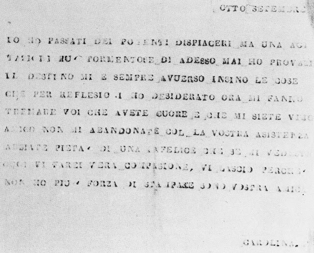

<!-- _class: title -->

Session 3

# Stakeholder Mapping + Causal Loop Introduction

<h2>Design Thinking for MBAs (Hybrid Section)</h2>

Thursday, March 12, 2026 &ensp;|&ensp; 6:30 PM &ensp;|&ensp; Online (Zoom) &ensp;|&ensp; Faculty: Patrick Ray

---

## Check-In

**Quick round:** Has anything shifted in your thinking since Session 2?

What did writing about your observation experience surface?

5 minutes

---

## Find the Duct Tape

**What did you find this week?** Any workarounds, improvised fixes, duct tape solutions?

Drop yours in the chat in one sentence. Then we'll hear 2-3 people elaborate.

10 minutes

- What's the fix? What's the real problem underneath?
- These workarounds are exactly what you'll look for during stakeholder research
- People's improvised fixes tell you where the system is failing

---

## Tonight's Arc

Two breakout room cycles, two tools:

### Stakeholder Mapping
- Deepen your Session 2 stakeholder list
- Map optimization goals, constraints, concerns
- Include at least one extreme user

### Causal Loop Mapping
- Learn a tool for mapping system dynamics
- Draft an initial causal loop for your scenario
- Identify what your research needs to test

---

## Design Abilities Tonight

### Learn From Others
Empathize with diverse viewpoints. Observe and learn from unfamiliar contexts. Tonight: stakeholder mapping, extreme users, seeking perspectives you wouldn't naturally encounter.

### Synthesize Information
Make sense of information and find insight within. Tonight: causal loop mapping turns scattered observations into a system-level picture.

### Navigate Ambiguity
Persist in the discomfort of not knowing. Tonight: your maps are hypotheses, not answers. The research period starts with uncertainty.

### Move Between Concrete and Abstract
Zoom in on specific stakeholder concerns, zoom out to system dynamics. Tonight: you'll do both, repeatedly.

---

## Why Map Stakeholders?

**A stakeholder map makes differences visible**: who's affected, what they want, and where their interests conflict.

### What You're Looking For
- Who is **affected** by this problem?
- Who has **influence** over it?
- Where do their interests conflict?
- Who is **invisible** in the current system?

### Why It Matters for Design
- Solutions that work for one stakeholder often create problems for another
- The stakeholders you forget are usually the ones whose needs go unmet
- Your research plan depends on knowing **who to talk to** and **what to ask them**

---

## Stakeholder Mapping

**Breakout rooms by team.** Deepen your stakeholder list from Session 2. Identify 4-5 stakeholders for your scenario.

For each stakeholder, fill in the template on the next slide:

Include at least one **extreme user**: someone who experiences the problem most intensely.

20 minutes

---

## Stakeholder Template

| Element | Prompt |
|---------|--------|
| **Who** | Specific role or identity (not generic) |
| **Optimizes for** | What are they trying to maximize? |
| **Constraints** | What limits their options? |
| **Top concerns** | What do they care about most? (2-3) |
| **Access** | Which team member can reach this person? |

If everyone on your list wants the same thing, you're missing someone. Stakeholder maps without tension are incomplete.

---

## What Is This?

---

## The First Typewriter

This is one of the oldest typewritten documents in existence. Written in 1808.

The machine that produced it didn't survive. **But the letters did.**

In 1808, Italian inventor Pellegrino Turri built one of the first working typewriters. He built it for exactly one person: **Countess Carolina Fantoni, who was blind.** She wanted to write letters independently, without dictating to someone else.

---

## Extreme Users Drive Innovation

Turri didn't set out to invent the typewriter. He set out to solve one person's problem: a blind woman who wanted to write her own letters.

That's what extreme users do. Their needs are so acute that they force you past incremental fixes into fundamentally different solutions.

---

## Debrief: The Overlooked Stakeholder

Each team shares one stakeholder they almost forgot or didn't initially consider.

- Why do we overlook certain stakeholders? What makes some invisible?
- The stakeholders you overlook are usually the ones absorbing the cost of the current system.

10 minutes

---

<!-- _class: transition -->

# Causal Loop Mapping

Why does this problem persist?

---

## What Is a Causal Loop Map?

A diagram that shows the **system dynamics** underlying your problem: what causes what, what reinforces what, and why it doesn't just fix itself.

### The Building Blocks
- **Nodes**: Specific factors in the system
- **Arrows**: Direction of influence
- **+/- signs**: (+) as A increases, B increases. (-) as A increases, B decreases.

### Two Types of Loops
- **Reinforcing (R)**: Self-amplifying. The problem feeds itself.
- **Balancing (B)**: Self-correcting. Something pushes back.

---

## Reading a Causal Loop

A simple three-node reinforcing loop:

<svg viewBox="0 0 400 300" xmlns="http://www.w3.org/2000/svg" style="max-height:240px;">
  <defs>
    <marker id="arr" viewBox="0 0 10 10" refX="9" refY="5" markerWidth="8" markerHeight="8" orient="auto">
      <path d="M 0 1 L 10 5 L 0 9 z" fill="#0D9488"/>
    </marker>
  </defs>
  <!-- Arrows -->
  <path d="M 255,55 C 310,65 340,110 340,155" fill="none" stroke="#0D9488" stroke-width="3" marker-end="url(#arr)"/>
  <path d="M 290,215 C 250,250 160,260 110,230" fill="none" stroke="#0D9488" stroke-width="3" marker-end="url(#arr)"/>
  <path d="M 60,175 C 45,130 65,75 115,50" fill="none" stroke="#0D9488" stroke-width="3" marker-end="url(#arr)"/>
  <!-- +/- labels -->
  <rect x="295" y="90" width="24" height="20" rx="5" fill="white" fill-opacity="0.9"/><text x="307" y="105" text-anchor="middle" font-family="Montserrat" font-weight="700" font-size="15" fill="#0D9488">+</text>
  <rect x="188" y="242" width="24" height="20" rx="5" fill="white" fill-opacity="0.9"/><text x="200" y="257" text-anchor="middle" font-family="Montserrat" font-weight="700" font-size="15" fill="#0D9488">+</text>
  <rect x="58" y="105" width="24" height="20" rx="5" fill="white" fill-opacity="0.9"/><text x="70" y="120" text-anchor="middle" font-family="Montserrat" font-weight="700" font-size="15" fill="#0D9488">+</text>
  <!-- Loop label -->
  <circle cx="195" cy="145" r="18" fill="white" stroke="#0D9488" stroke-width="2"/><text x="195" y="150" text-anchor="middle" font-family="Montserrat" font-weight="700" font-size="13" fill="#0D9488">R</text>
  <!-- Nodes -->
  <rect x="105" y="22" width="155" height="44" rx="8" fill="#1E3A5F"/><text x="182" y="49" text-anchor="middle" font-family="Open Sans" font-weight="600" font-size="13" fill="#fff">High demand</text>
  <rect x="255" y="160" width="155" height="44" rx="8" fill="#1E3A5F"/><text x="332" y="187" text-anchor="middle" font-family="Open Sans" font-weight="600" font-size="13" fill="#fff">Long wait times</text>
  <rect x="0" y="180" width="155" height="44" rx="8" fill="#1E3A5F"/><text x="77" y="207" text-anchor="middle" font-family="Open Sans" font-weight="600" font-size="13" fill="#fff">Staff burnout</text>
</svg>

### How to Read It
1. **Follow the arrows.** High demand → long wait times → staff burnout → high demand
2. **Check the signs.** All (+) means each factor increases the next
3. **Identify the loop type.** All same direction? Reinforcing (R): it spirals. A minus sign flips the direction? **Balancing (B)**: something pushes back.

---

## From Observation to Causal Loop

We'll review a real TETHER observation, then walk through the causal loop map it produced.

**Four loops to trace:**

1. **R1** "Invisibility Cycle": The core reinforcing loop. The problem feeds itself.
2. **B1** "Companion Workaround": A balancing loop. Does this solve the problem?
3. **B2** "Accidental Aid": Two workarounds converge on the same variable.
4. **R2** "Crowd Amplifier": A second reinforcing pathway. It gets worse.

As we trace, watch for: Where does an **effect become a cause**? Who **benefits**? Who **bears the cost**?

---

## The Observation

### 99 Ranch Food Court, Houston
An elderly man with an unsteady gait and a tall cane enters the food court. He steadies himself on retractable barrier posts spaced one foot apart. There is no break in the perimeter barrier. He sits alone at a four-top with no food. A younger companion joins him and shares food. Meanwhile, up to 20 people crowd around the duck stall's hot case.

### What do you notice?
- Who is this space designed for?
- What workarounds are happening?
- Who benefits from the current design?
- Who bears the cost?

---

<!-- _class: diagram -->

## Causal Loop Example

  

    

    Reinforcing (R1, R2)
  

  

    

    Balancing (B1, B2)
  

  

    (+) same direction &ensp; (&minus;) opposite direction
  

<svg viewBox="0 0 1320 540" xmlns="http://www.w3.org/2000/svg">
  <defs>
    <marker id="at" viewBox="0 0 10 10" refX="9" refY="5" markerWidth="9" markerHeight="9" orient="auto">
      <path d="M 0 1 L 10 5 L 0 9 z" fill="#0D9488"/>
    </marker>
    <marker id="ao" viewBox="0 0 10 10" refX="9" refY="5" markerWidth="9" markerHeight="9" orient="auto">
      <path d="M 0 1 L 10 5 L 0 9 z" fill="#F97316"/>
    </marker>
    <filter id="sh" x="-4%" y="-4%" width="108%" height="116%">
      <feDropShadow dx="1" dy="2" stdDeviation="2" flood-opacity="0.08"/>
    </filter>
  </defs>
  <!-- R1 ARROWS -->
  <path d="M 685,50 C 745,42 778,88 798,133" fill="none" stroke="#0D9488" stroke-width="3.5" marker-end="url(#at)"/>
  <path d="M 935,184 C 965,255 965,305 935,359" fill="none" stroke="#0D9488" stroke-width="3.5" marker-end="url(#at)"/>
  <path d="M 800,405 C 765,440 725,465 687,480" fill="none" stroke="#0D9488" stroke-width="3.5" marker-end="url(#at)"/>
  <path d="M 435,480 C 390,465 350,440 309,405" fill="none" stroke="#0D9488" stroke-width="3.5" marker-end="url(#at)"/>
  <path d="M 175,359 C 145,305 145,255 175,186" fill="none" stroke="#0D9488" stroke-width="3.5" marker-end="url(#at)"/>
  <path d="M 300,133 C 330,88 368,42 433,50" fill="none" stroke="#0D9488" stroke-width="3.5" marker-end="url(#at)"/>
  <!-- R2 ARROWS (dashed) -->
  <path d="M 685,30 C 850,-15 1120,10 1175,240" fill="none" stroke="#0D9488" stroke-width="3.5" stroke-dasharray="10,5" marker-end="url(#at)"/>
  <path d="M 1175,299 C 1170,335 1120,365 1062,385" fill="none" stroke="#0D9488" stroke-width="3.5" stroke-dasharray="10,5" marker-end="url(#at)"/>
  <!-- B1 ARROWS -->
  <path d="M 478,469 C 474,420 470,380 466,341" fill="none" stroke="#F97316" stroke-width="3.5" marker-end="url(#ao)"/>
  <path d="M 585,308 C 660,312 740,348 798,375" fill="none" stroke="#F97316" stroke-width="3.5" marker-end="url(#ao)"/>
  <!-- B2 ARROWS (dashed) -->
  <path d="M 830,184 C 815,200 790,218 770,228" fill="none" stroke="#F97316" stroke-width="3.5" stroke-dasharray="10,5" marker-end="url(#ao)"/>
  <path d="M 730,282 C 760,320 800,350 840,365" fill="none" stroke="#F97316" stroke-width="3.5" stroke-dasharray="10,5" marker-end="url(#ao)"/>
  <!-- +/- LABELS -->
  <rect x="728" y="60" width="26" height="22" rx="6" fill="white" fill-opacity="0.92"/><text x="741" y="77" text-anchor="middle" font-family="Montserrat" font-weight="700" font-size="17" fill="#0D9488">+</text>
  <rect x="956" y="260" width="26" height="22" rx="6" fill="white" fill-opacity="0.92"/><text x="969" y="277" text-anchor="middle" font-family="Montserrat" font-weight="700" font-size="17" fill="#0D9488">+</text>
  <rect x="733" y="438" width="26" height="22" rx="6" fill="white" fill-opacity="0.92"/><text x="746" y="455" text-anchor="middle" font-family="Montserrat" font-weight="700" font-size="17" fill="#0D9488">+</text>
  <rect x="343" y="438" width="26" height="22" rx="6" fill="white" fill-opacity="0.92"/><text x="356" y="455" text-anchor="middle" font-family="Montserrat" font-weight="700" font-size="17" fill="#0D9488">+</text>
  <rect x="133" y="260" width="26" height="22" rx="6" fill="white" fill-opacity="0.92"/><text x="146" y="277" text-anchor="middle" font-family="Montserrat" font-weight="700" font-size="17" fill="#0D9488">+</text>
  <rect x="343" y="60" width="26" height="22" rx="6" fill="white" fill-opacity="0.92"/><text x="356" y="77" text-anchor="middle" font-family="Montserrat" font-weight="700" font-size="17" fill="#0D9488">+</text>
  <rect x="942" y="18" width="26" height="22" rx="6" fill="white" fill-opacity="0.92"/><text x="955" y="35" text-anchor="middle" font-family="Montserrat" font-weight="700" font-size="17" fill="#0D9488">+</text>
  <rect x="1115" y="330" width="26" height="22" rx="6" fill="white" fill-opacity="0.92"/><text x="1128" y="347" text-anchor="middle" font-family="Montserrat" font-weight="700" font-size="17" fill="#0D9488">+</text>
  <rect x="467" y="392" width="26" height="22" rx="6" fill="white" fill-opacity="0.92"/><text x="480" y="409" text-anchor="middle" font-family="Montserrat" font-weight="700" font-size="17" fill="#F97316">+</text>
  <rect x="695" y="332" width="26" height="22" rx="6" fill="white" fill-opacity="0.92"/><text x="708" y="349" text-anchor="middle" font-family="Montserrat" font-weight="700" font-size="19" fill="#F97316">&minus;</text>
  <rect x="793" y="195" width="26" height="22" rx="6" fill="white" fill-opacity="0.92"/><text x="806" y="212" text-anchor="middle" font-family="Montserrat" font-weight="700" font-size="17" fill="#F97316">+</text>
  <rect x="790" y="318" width="26" height="22" rx="6" fill="white" fill-opacity="0.92"/><text x="803" y="335" text-anchor="middle" font-family="Montserrat" font-weight="700" font-size="19" fill="#F97316">&minus;</text>
  <!-- LOOP LABELS -->
  <circle cx="340" cy="235" r="21" fill="white" stroke="#0D9488" stroke-width="2.5"/><text x="340" y="240" text-anchor="middle" font-family="Montserrat" font-weight="700" font-size="14" fill="#0D9488">R1</text><text x="340" y="267" text-anchor="middle" font-family="Montserrat" font-weight="600" font-size="9" fill="#0D9488">Invisibility Cycle</text>
  <circle cx="1040" cy="55" r="21" fill="white" stroke="#0D9488" stroke-width="2.5" stroke-dasharray="5,3"/><text x="1040" y="60" text-anchor="middle" font-family="Montserrat" font-weight="700" font-size="14" fill="#0D9488">R2</text><text x="1040" y="87" text-anchor="middle" font-family="Montserrat" font-weight="600" font-size="9" fill="#0D9488">Crowd Amplifier</text>
  <circle cx="598" cy="400" r="21" fill="white" stroke="#F97316" stroke-width="2.5"/><text x="598" y="405" text-anchor="middle" font-family="Montserrat" font-weight="700" font-size="14" fill="#F97316">B1</text><text x="598" y="430" text-anchor="middle" font-family="Montserrat" font-weight="600" font-size="9" fill="#F97316">Companion Workaround</text>
  <circle cx="680" cy="320" r="21" fill="white" stroke="#F97316" stroke-width="2.5" stroke-dasharray="5,3"/><text x="680" y="325" text-anchor="middle" font-family="Montserrat" font-weight="700" font-size="14" fill="#F97316">B2</text><text x="680" y="350" text-anchor="middle" font-family="Montserrat" font-weight="600" font-size="9" fill="#F97316">Accidental Aid</text>
  <!-- NODE BOXES -->
  <rect x="435" y="19" width="250" height="58" rx="10" fill="#1E3A5F" filter="url(#sh)"/><text x="560" y="41" text-anchor="middle" font-family="Open Sans" font-weight="600" font-size="15" fill="#fff"><tspan x="560">Space designed for</tspan><tspan x="560" dy="19">high-volume throughput</tspan></text>
  <rect x="800" y="126" width="260" height="58" rx="10" fill="#1E3A5F" filter="url(#sh)"/><text x="930" y="148" text-anchor="middle" font-family="Open Sans" font-weight="600" font-size="15" fill="#fff"><tspan x="930">Dense barriers &amp;</tspan><tspan x="930" dy="19">standing-only queues</tspan></text>
  <rect x="800" y="361" width="260" height="58" rx="10" fill="#1E3A5F" filter="url(#sh)"/><text x="930" y="383" text-anchor="middle" font-family="Open Sans" font-weight="600" font-size="15" fill="#fff"><tspan x="930">Difficulty accessing</tspan><tspan x="930" dy="19">food independently</tspan></text>
  <rect x="435" y="469" width="250" height="58" rx="10" fill="#1E3A5F" filter="url(#sh)"/><text x="560" y="491" text-anchor="middle" font-family="Open Sans" font-weight="600" font-size="15" fill="#fff"><tspan x="560">Depend on companion</tspan><tspan x="560" dy="19">for food access</tspan></text>
  <rect x="43" y="361" width="264" height="58" rx="10" fill="#1E3A5F" filter="url(#sh)"/><text x="175" y="383" text-anchor="middle" font-family="Open Sans" font-weight="600" font-size="15" fill="#fff"><tspan x="175">Mobility-limited visitors</tspan><tspan x="175" dy="19">less visible to operators</tspan></text>
  <rect x="50" y="126" width="250" height="58" rx="10" fill="#1E3A5F" filter="url(#sh)"/><text x="175" y="148" text-anchor="middle" font-family="Open Sans" font-weight="600" font-size="15" fill="#fff"><tspan x="175">No pressure to design</tspan><tspan x="175" dy="19">for accessibility</tspan></text>
  <rect x="335" y="281" width="250" height="58" rx="10" fill="#F97316" filter="url(#sh)"/><text x="460" y="303" text-anchor="middle" font-family="Open Sans" font-weight="700" font-size="15" fill="#1E3A5F"><tspan x="460">Companion brings food;</tspan><tspan x="460" dy="19">needs met informally</tspan></text>
  <rect x="640" y="220" width="220" height="54" rx="10" fill="#F97316" filter="url(#sh)"/><text x="750" y="241" text-anchor="middle" font-family="Open Sans" font-weight="700" font-size="14" fill="#1E3A5F"><tspan x="750">Barrier posts double</tspan><tspan x="750" dy="18">as mobility aids</tspan></text>
  <rect x="1075" y="245" width="220" height="54" rx="10" fill="#1E3A5F" filter="url(#sh)"/><text x="1185" y="266" text-anchor="middle" font-family="Open Sans" font-weight="600" font-size="14" fill="#fff"><tspan x="1185">Crowds gather at</tspan><tspan x="1185" dy="18">popular stalls</tspan></text>
</svg>

---

## Causal Loop Drafting

**Sketch an initial causal loop map for your scenario.**

1. Put your **core problem** in the center. Be specific.
2. Identify **4-5 contributing factors and effects**. Draw the arrows.
3. Find at least **one loop**. Label it R or B.
4. Add **+/- signs** to your arrows.
5. Ask: **who benefits** from this staying the way it is?

20 minutes

---

## What a Good Causal Loop Looks Like

### Common Pitfalls
- Nodes too abstract ("bad communication")
- All arrows going one direction (that's a chain, not a loop)
- Forgetting to close the loop
- Symptoms instead of causes

### Signs You're On Track
- You can trace a path that returns to where it started
- Your +/- signs make logical sense
- You found something that surprised you
- You can name who benefits from the status quo

Not "communication issues." What specifically? "Frontline staff feedback doesn't reach decision-makers." Now you can map what causes that and trace the loop.

---

## Share Your Loops

Each team: **"Our reinforcing loop is ___. Our balancing loop is ___."**

- Does it ring true? What would you want to investigate to test it?
- **Where would you intervene?** Which node, if changed, would break the cycle?
- Name your loops. A loop with a name is a loop your team can reference.

---

## What's Due for Session 4

### Thursday, March 26

### Stakeholder Research
Team deliverable. Each member conducts 1-2 observations or interviews, then compile.

**Details on Canvas.**

### Causal Loop Map
Team deliverable. Start from tonight's draft. Let your research reveal new dynamics.

**Details on Canvas.**

---

## What's Next

- **Session 4**: Thursday, March 26, 6:30 PM (Online, Zoom)
- Synthesize research, refine causal loop maps, define the problem

Both deliverables are hypotheses right now. The next two weeks of research will tell you where you're wrong. That's the point.

